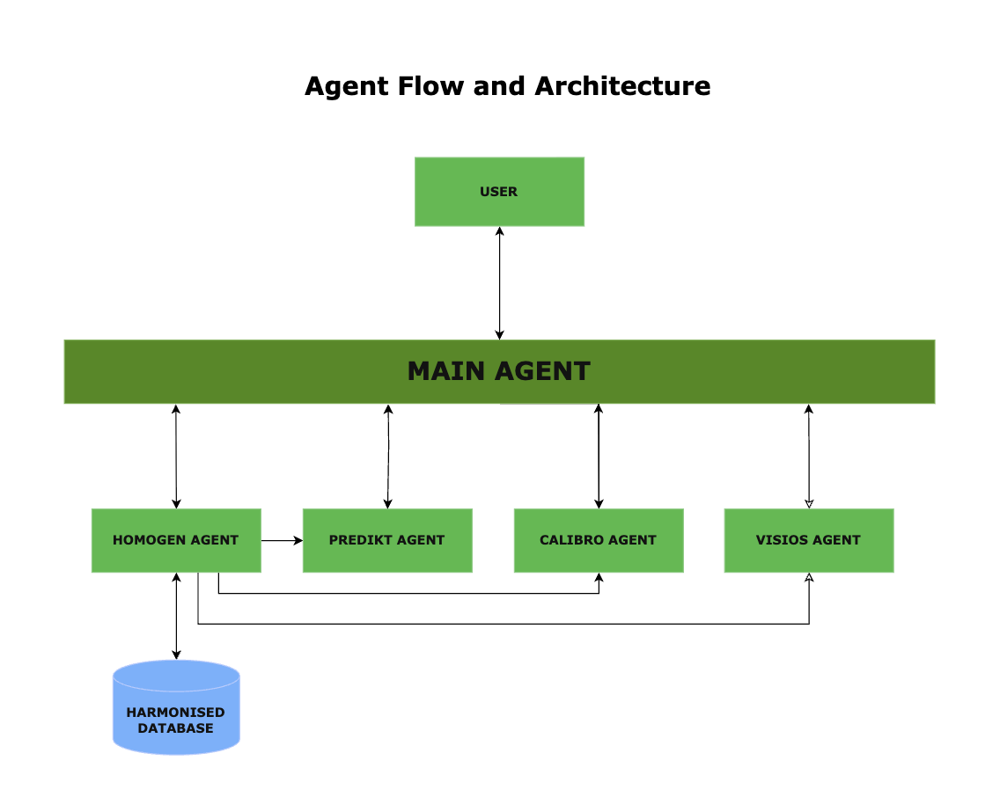

# AI4HAB 🚰🌱

---

Welcome to **AI4HAB** – an intelligent multi-agent AI system for the monitoring, prediction, and mitigation of **Harmful Algal Blooms (HABs)** in freshwater ecosystems.

---

## 🎯 Key Objectives

1. Develop an agent-based architecture combining environmental sensing, satellite data, and AI models  
2. Harmonize multi-source data for real-time and historical analysis  
3. Forecast the occurrence, intensity, and spread of HABs using machine learning  
4. Generate early warnings and actionable insights for local authorities and citizens  
5. Ensure system interpretability through explainable AI (XAI) components  
6. Continuously improve through feedback loops and adaptive learning  
7. Apply the system to various lake types, with a focus on German water bodies  

---

## 🤖 AI Agents in the System

| Agent Name   | Description |
|--------------|-------------|
| **HOMOGEN**  | Ingests, cleans, aligns, and fuses heterogeneous sensor, satellite, and meteorological data. |
| **CALIBRO**  | Calibrates Earth Observation (EO) data using in-situ ground truth. |
| **PREDIKT**  | Predicts the likelihood, intensity, and spatial spread of HABs using ML. |
| **DETEKTA**  | Identifies ongoing or imminent HAB events based on real-time data and imagery. |
| **REACTOR**  | Translates predictions into actions, alerts, and stakeholder recommendations. |
| **EXPLAINA** | Explains model outputs and decisions in human-understandable terms. |
| **VISIOS**   | Enables image-based reporting of HABs by users, with real-time AI analysis. |
| **FEEDBACKO**| Monitors system outputs and user input to enable continuous learning. |
| **Talk2PDFs**| Extracts and interprets government policies and guidelines from PDFs. |

---

## 🧠 Architecture Diagram and Flow

### 🔧 System Architecture

  

### 🗂️ Description

In the AI4HAB system, the **Main Agent** orchestrates and coordinates the execution of all other agents based on a defined logical sequence:

1. The process begins with the **HOMOGEN** agent, which ingests, cleans, and harmonizes heterogeneous data from sensors, satellite feeds, and external sources. This cleaned data is then stored in the centralized **Harmonized Database**.
   
2. Once harmonized data is available, the **Main Agent** triggers the **PREDIKT** agent. Using machine learning models, PREDIKT forecasts the **likelihood**, **intensity**, and **spatial spread** of harmful algal blooms (HABs).

3. Following this, the **CALIBRO** agent is activated to calibrate satellite observations using in-situ ground truth data, improving the accuracy and confidence of EO-based predictions.

4. Finally, the **VISIOS** agent is invoked. This component enables end-users to upload geotagged images of water bodies. The system then analyzes these images using deep learning techniques and provides visual feedback on bloom presence, offering a citizen science layer to the AI ecosystem.

5. All the agents will contact HOMOGEN Agent as the harmonised data will be stored within it, so as to not have any security breaches.

---

